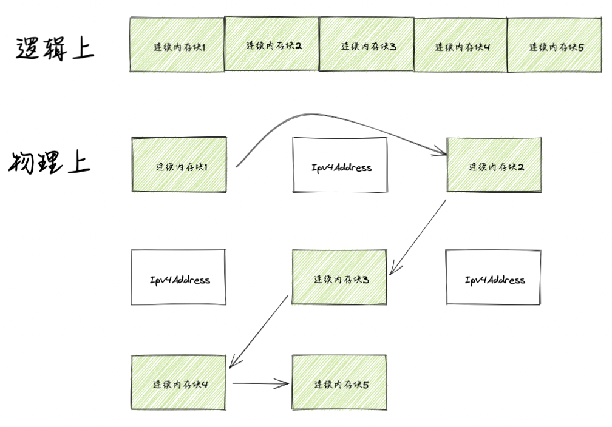
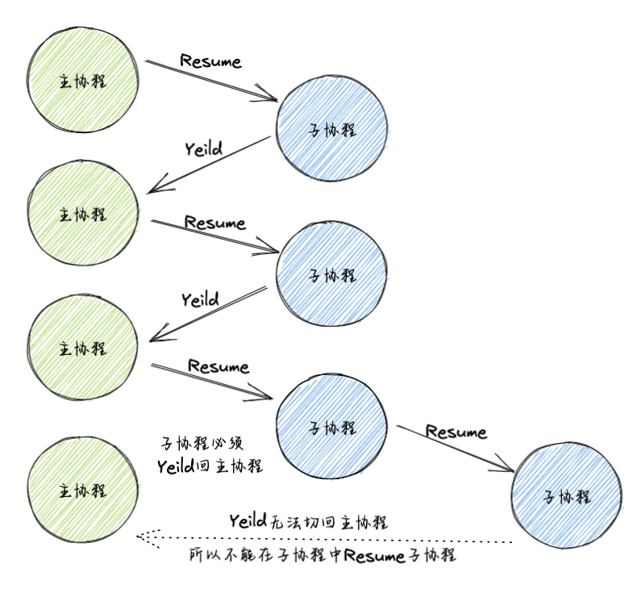
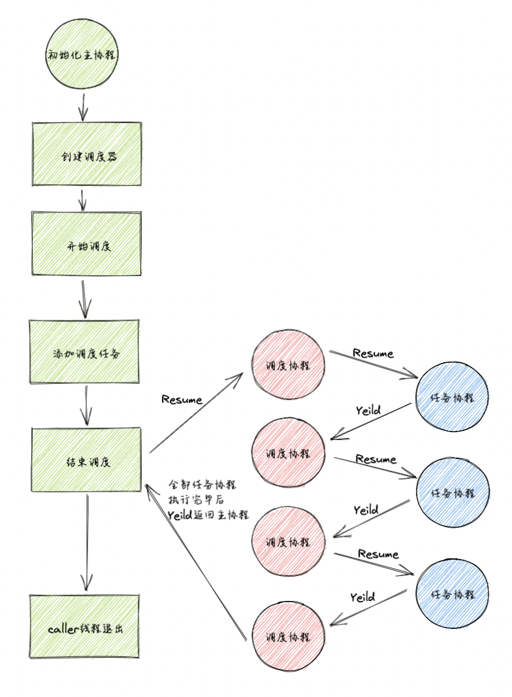
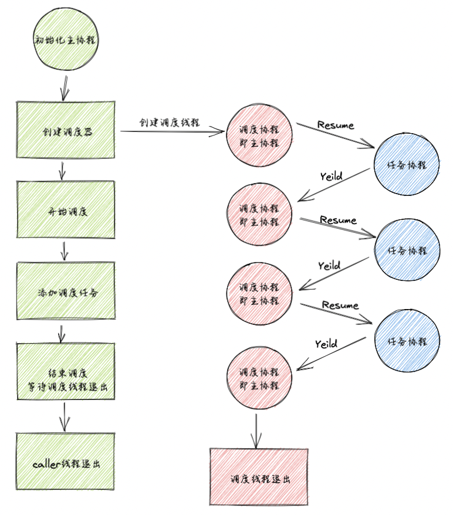
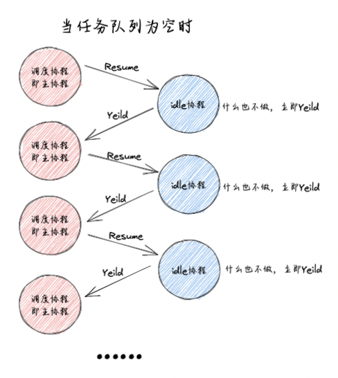
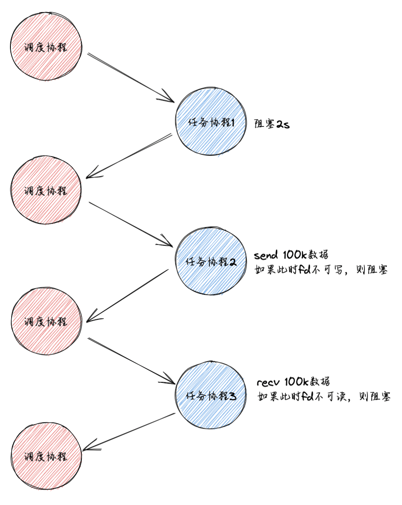
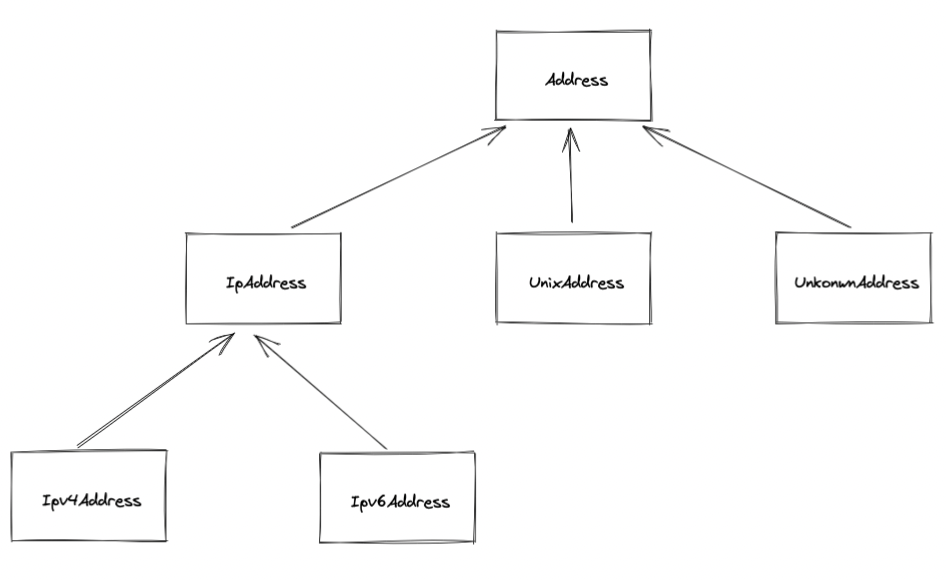

## 使用

该项目实现了一个服务器框架，包含日志模块、配置模块、线程模块、定时器模块、字节数组模块、协程模块、协程调度模块、IO协程调度模块、HOOK模块、Address模块、Socket模块。

C++标准：C++11。

依赖三方库：dl、pthread、yaml-cpp、boost库（boost::lexical_cast）。

测试程序生成：

```shell
chmod +x build.sh
./build.sh
```

使用该框架：

```cpp
#include <serverframework/serverframework.h>
```

## 基础模块

### 日志模块

对应代码log.h、log.cc。

仿log4cpp日志架构。

- LogLevel类：日志级别。
- Logger类：日志器类。
- LogAppender:日志输出地，虚基类，用于派生出不同的子类重写LogAppender的log方法，每个appender类自带一个默认的LogFormatter）
- StdoutAppender:继承于LogAppender类，打印到控制台。
- FileAppender:继承于LogAppender类，打印到文件。
- LogFormatter:LogFormatter，定义日志输出格式，从模板字符串中解析提取出模板项，有一个内部纯虚类FormatItem，
- LogFormatter内部类FormatItem(虚析构函数，和纯虚Format函数)用于格式化每一个模板项成员函数：
- FormatItem的n个派生类：重写其基类的Format方法，写入每一项信息
- LogEvent:定义一次日志事件
- LogEventWrapper：日志事件包装器，方便宏定义，内部包含日志事件和日志器，其析构时实际输出日志
- LoggerManager：采用单例模式，管理所有日志器，默认有一个root logger

> LoggerManager 与 Logger 关系： 1 对 n；
> Logger 与 LogAppender关系： 1 对 n；
> LogAppender 与 LogFormatter关系： 1 对 1；
> LogFormatter 与 FormatItem派生类关系： 1 对 n

日志打印流程:

- 宏定义：如果日志等级满足要求，构造一个LogEventWrap；

  ```cpp
  #define LOG_ROOT() LoggerMgr::GetInstance()->GetRoot()
  #define LOG_NAME(name) LoggerMgr::GetInstance()->GetLogger(name)
  // 流风格日志写入宏定义
  #define LOG_LEVEL(logger, level)                                              \
    if (level <= logger->GetLevel())                                            \
    LogEventWrapper(logger, LogEvent::ptr(new LogEvent(                         \
                                level, __FILE__, __LINE__,                      \
                                GetElapsedMs() - logger->GetCreateTime(), 0, 0, \
                                time(0), "thread_name", logger->GetName())))    \
        .GetEvent()                                                             \
        ->GetSS()
  ```
  
- ``LogEventWrap::~LogEventWrap``

  ```cpp
  LogEventWrap::~LogEventWrap() {
      m_logger->log(m_event);
  }
  ```

- 具体某一个Logger,``Logger::log``

  ```cpp
  void Logger::log(LogEvent::ptr event) {
      if(event->getLevel() <= m_level) {
          for(auto &i : m_appenders) {
              i->log(event);
          }
      }
  }
  ```

- 具体某一个Appender,``StdoutLogAppender::log``

  ```cpp
  void StdoutLogAppender::log(LogEvent::ptr event) {
      if(m_formatter) {
          m_formatter->format(std::cout, event);
      } else {
          m_defaultFormatter->format(std::cout, event);
      }
  }
  ```

- ``LogFormatter::format``

  ```cpp
  // std::vector<FormatItem::ptr> m_items; 这就是LogFormatter类的一个数据成员
  std::string LogFormatter::format(LogEvent::ptr event) {
      std::stringstream ss;
      for(auto &i:m_items) {
          i->format(ss, event);
      }
      return ss.str();
  }
  ```

- 具体某一项的``StringFormatItem::format``

  ```cpp
  void format(std::ostream& os, LogEvent::ptr event) override {
          os << m_string;
      }
  ```


### 配置模块

对应代码config.h、config.cc。

实现功能：

- 从文件拉取配置项
- 配置更改通知

### 线程模块

对应代码thread.h、thread.cc、mutex.h、mutex.cc。

实现功能：

- 提供线程类Thread
- 提供线程粒度的互斥与同步机制：
  - `Semaphore`: 计数信号量，基于`sem_t`实现
  - `Mutex`: 互斥锁，基于`pthread_mutex_t`实现
  - `RWMutex`: 读写锁，基于`pthread_rwlock_t`实现
  - `Spinlock`: 自旋锁，基于`pthread_spinlock_t`实现
  - `CASLock`: 原子锁，基于`std::atomic_flag`实现
  - 实现范围锁模板

### 定时器模块

对应代码timer.h、timer.cc。

实现功能：

- 提供定时器任务类Timer
- 提供定时器容器类TimerManager：使用最小堆管理Timer对象

所有定时器根据绝对的超时时间点进行排序，每次取出离当前时间最近的一个超时时间点，计算出超时需要等待的时间，然后等待超时。超时时间到后，获取当前的绝对时间点，然后把最小堆里超时时间点小于这个时间点的定时器都收集起来，执行它们的回调函数。

> 需要配合协程调度模块才能完成定时任务，也就是Timer的回调函数是给调度协程预设一个协程对象，等定时时间到了就Resume预设的协程对象。

### 字节数组模块

对应代码ByteArray.h、ByteArray.cc。

实现功能：

- 可作为网络传输中的缓冲区
- 实现了基础类型的序列化与反序列化、支持设置大小端顺序

ByteArray底层实现：逻辑上抽象为一个大的连续字节数组。



使用Varints、ZigZag、TLV编码方案，支持如下类型的序列化与反序列化：

- 固定长度的有符号/无符号8位、16位、32位、64位整数
- 不固定长度的有符号/无符号32位、64位整数
- float、double类型
- 字符串，包含字符串长度，长度范围支持16位、32位、64位。
- 字符串，不包含长度。

## 协程相关模块

### 协程模块

基于`ucontext_t`实现非对称有栈协程，对应代码中的Fiber类。

协程状态变化图：

每个线程可以有n个协程，分为两类，主协程和子协程，其切换方式如下：



该模块存在问题：

1. 子协程中无法创建子协程
2. 需要用户手动调度协程
3. 如果一个协程发生阻塞，则其所在线程阻塞

协程调度模块解决问题1、2，HOOK模块解决问题3。

### 协程调度模块

对应代码Scheduler类，实现功能：

- 实现了一个多线程公平调度器，可创建一个线程池，在N个线程运行M个协程
- 调度器所在线程（caller线程）也可参与协程调度
- 实现 “协程亲缘性” 功能，将协程绑定到指定线程上。协程可以在线程之间进行切换，也可以绑定到指定线程运行

caller线程使用TLS变量可存储了三个协程上下文：

- 当caller线程不参与协程调度
  - 主协程
  - 调度协程为空，无意义
  - （某一个）任务协程，即子协程
- 当caller线程参与协程调度
  - 主协程
  - 调度协程（也可看作是子协程，待任务协程处理完毕后需要切换回主协程）
  - （某一个）任务协程，即子协程

caller线程参与协程调度时，caller线程的协程切换图：



调度线程使用TLS变量可存储了三个协程上下文：

- 主协程
- 调度协程（即主协程）
- （某一个）任务协程，即子协程

调度线程的协程切换图：



当任务队列空闲时：



```cpp
// 提醒其他调度线程有任务来了，但这里不做任何事，仅仅是忙等
void Scheduler::Tickle() { LOG_DEBUG(g_logger) << "ticlke"; }

// 当任务队列没有任务时，切换到idle协程
// 但idle协程在这里不做任何事，当调度不能停止时，立即让出CPU
void Scheduler::Idle() {
  LOG_DEBUG(g_logger) << "Idle";
  while (!Stopping()) {
    serverframework::Fiber::GetThis()->Yield();
  }
}
```

该模块存在问题：任务队列空闲时调度线程忙等待，CPU占有率爆表，该问题由IO协程调度模块解决。

### IO协程调度模块

对应代码IOManager类，继承于Scheduler类。

实现功能：

- 支持epoll事件及对应回调的操作接口
- 重写Scheduler类idle函数、tickle函数，通过匿名管道配合epoll，实现任务队列空闲时让出CPU，线程进入阻塞，当任务来临时唤醒该线程处理任务

idle、tickle如何处理？

/------------------------------------------------<font color="red">画好图贴上来</font>-----------------------------------------------------------------------------------------------------------------------------------------

### HOOK模块

对应代码hook.cc、hook.h。

使用基于动态链接的侵入式hook。实现功能：结合IO协程调度模块对某些不具异步功能的API进行hook，使展现出异步的性能。

对以下三类api进行hook：

1. 延时阻塞类：sleep、usleep、nanosleep
2. socket类：socket、connect、accept、close、fcntl、ioctl、getsockopt、setsockopt
3. socket fd的io相关api：read、readv、recv、recvfrom、recvmsg、write、writev、send、sendto、sendmsg

举例，如果我们需要在一个线程上调度如下三个协程：

1. 协程1：sleep(2) 睡眠两秒后返回。
2. 协程2：在scoket fd1 上send 100k数据。
3. 协程3：在socket fd2 上recv直到数据接收成功。

未开启hook的执行流程图：



开启hook的执行流程图：


这样等之后，定时任务到期执行其回调函数（协程1Resume），当对应fd上出现写事件（协程2Resume），当对应fd上出现读事件（协程3Resume）。这样能达到相同的效果，又不会使线程阻塞。

## 网络相关模块

### Address模块

对应代码address.cc、address.h。

实现功能：提供网络地址相关的类，支持与网络地址相关的操作，一共有以下几个类：

- `Address`：所有网络地址的基类，抽象类，对应sockaddr类型，但只包含抽象方法，不包含具体的成员。除此外，Address作为地址类还提供了网络地址查询及网卡地址查询功能。
- `IPAddress`：IP地址的基类，抽象类，在Address基础上，增加了IP地址相关的端口以及子网掩码、广播地址、网段地址操作，同样是只包含抽象方法，不包含具体的成员。
- `IPv4Address`：IPv4地址类，实体类，表示一个IPv4地址，对应sockaddr_in类型，包含一个sockaddr_in成员，可以操作该成员的网络地址和端口，以及获取子码掩码等操作。
- `IPv6Address`：IPv6地址类，实体类，与IPv4Address类似，表示一个IPv6地址，对应sockaddr_in6类型，包含一个sockaddr_in6成员。
- `UnixAddreess`：Unix域套接字类，对应sockaddr_un类型，同上。
- `UnknownAddress`：表示一个未知类型的套接字地址，实体类，对应sockaddr类型，这个类型与Address类型的区别是它包含一个sockaddr成员，并且是一个实体类。

继承体系图：



### Socket模块

对应代码socket.h、socket.cc。

套接字类，表示一个套接字对象。

封装如下数据成员：

1. 文件描述符
2. 地址类型（AF_INET, AF_INET6等）
3. 套接字类型（SOCK_STREAM, SOCK_DGRAM等）
4. 协议类型（这项其实可以忽略）
5. 是否连接（针对TCP套接字，如果是UDP套接字，则默认已连接）
6. 本地地址和对端的地址

提供如下方法：

1. 创建各种类型的套接字对象的方法（TCP套接字，UDP套接字，Unix域套接字）
2. 设置套接字选项，比如超时参数
3. bind/connect/listen方法，实现绑定地址、发起连接、发起监听功能 
4. accept方法，返回连入的套接字对象
5. 发送、接收数据的方法
6. 获取本地地址、远端地址的方法
7. 获取套接字类型、地址类型、协议类型的方法
8. 取消套接字读、写的方法
