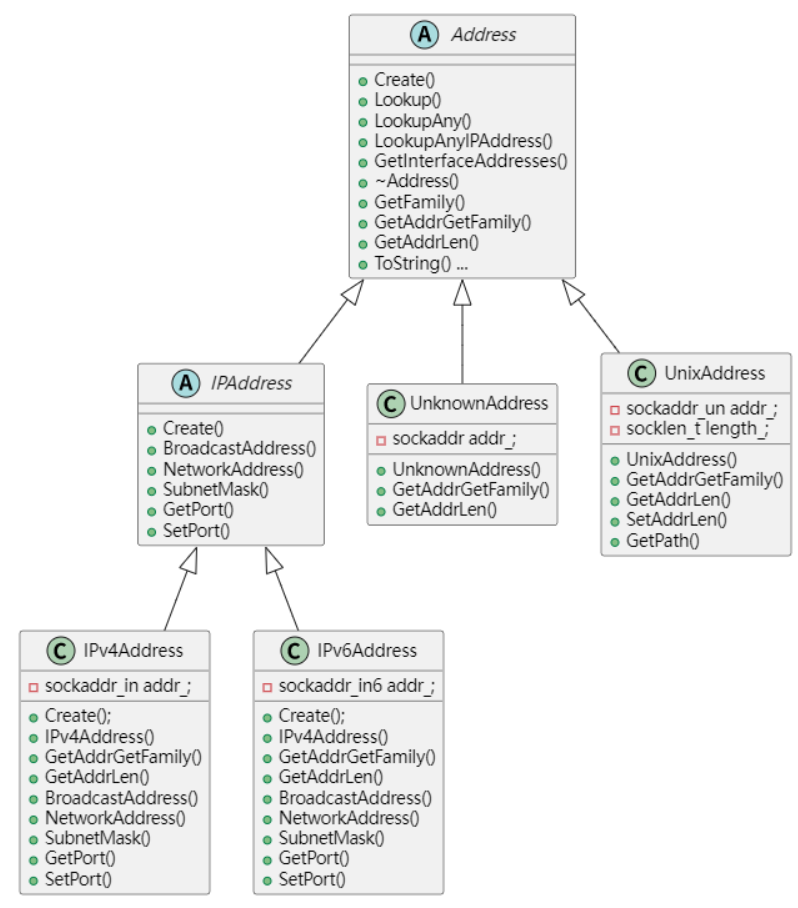

## 使用

该项目实现了一个服务器框架，包含日志模块、配置模块、线程模块、字节数组模块、协程模块、协程调度模块、Address模块、Socket模块、IO协程调度模块、Hook模块。

- 系统环境：2023 x86_64 GNU/Linux 6.1.41-1-MANJARO
- 编码风格：Google C++ Style
- C++标准：C++11
- 编译器：GCC13.1.0

依赖三方库：dl、pthread、yaml-cpp、boost库（仅使用boost::lexical_cast）。

```shell
sudo pacman -S yaml-cpp
sudo pacman -S boost
```

编译、测试程序生成：

```shell
chmod +x clean.sh
./clean.sh
chmod +x build.sh
./build.sh
```

使用该框架：

```cpp
#include "serverframework.h"  // 包含allinone头文件
编写程序
# 编译时链接框架的库
```

## 基础模块

### 日志模块

日志模块对应serverframework/log文件夹，该模块实现仿了一个Log4cpp架构的日志器。

日志模块使用示例：

```cpp
// 获取默认日志器
serverframework::Logger::ptr g_logger = LOG_ROOT();  
// 新建日志器test_logger
serverframework::Logger::ptr test_logger = LOG_NAME("test_logger");
// 流式打印
LOG_FATAL(g_logger) << "fatal msg";
// C风格打印
LOG_FMT_FATAL(g_logger, "fatal %s:%d", __FILE__, __LINE__);
```

日志模块由以下类组成：

- `LogLevel`：表示日志级别
- `LogEvent`：包装一次日志事件，内部包含了该条日志消息的所有内容
- `LogFormatter`：日志格式化器，表示日志消息用什么样的格式输出
- `LogAppender`：日志输出地，表示日志消息输出的目的地
- `Logge`r：日志器，用于写日志，包含一个或多个`LogAppender`
- `LogEventWrapper`：对日志器和日志事件的封装，方便宏的编写
- `LoggerManager`：使用单例模式，对框架中所有的日志器进行管理

日志模块类图：


日志打印流程图：


### ENV模块

ENV模块对应serverframework/env文件夹，该模块是对系统调用相关接口的封装，比如对线程、互斥量的封装。

考虑到想要方便地控制线程地启动时机（并且`std::thread`也是基于`pthread`系列调用的封装），所以并未采用`std::thread`，而是基于`pthread`系列调用进行封装。

实现功能：

- 提供线程类`Thread`
- 提供线程粒度的互斥与同步机制：
  - `Semaphore`: 计数信号量，基于`sem_t`实现
  - `Mutex`: 互斥锁，基于`pthread_mutex_t`实现
  - `RWMutex`: 读写锁，基于`pthread_rwlock_t`实现
  - `Spinlock`: 自旋锁，基于`pthread_spinlock_t`实现
  - `CASLock`: 原子锁，基于`std::atomic_flag`实现
  - 实现RAII范围锁模板

### 配置模块

配置模块对应serverframework/config文件夹。该模块采用**约定优于配置**的思想，仅在配置文件中写入与默认值不同的配置项，减少配置模块的工作量。配置文件中每个配置项由名称、描述、值组成，将每个需要自定义值的配置项写入一个yaml文件，配置模块利用yaml-cpp库读取配置文件。

配置模块组成：

- `ConfigVarBase`:表示一个配置项中的名称和描述
- `ConfigVar`:模板类，表示一个配置项（每个配置项的值类型可能各不相同）
- `Config`:管理所有的配置项

配置模块实现功能：

- 从文件读取（与默认值不同的）配置项
- 配置更改通知

配置模块类图：


配置文件示例：

server.yml:

```yaml
tcp_server:
  read_timeout: 120000
```

log.yml:

```yaml
logs:
    - name: root
      level: info
      appenders:
          - type: StdoutLogAppender
            pattern: "%d{%Y-%m-%d %H:%M:%S} %T%t%T%N%T%F%T[%p]%T[%c]%T%f:%l%T%m%n"
    - name: system
      level: info
      appenders:
          - type: StdoutLogAppender
          - type: FileLogAppender
            file: /root/sylar-from-scratch/system.txt
    - name: http
      level: debug
      appenders:
          - type: StdoutLogAppender
            pattern: "%f:%l%T%m%n"
```

### 字节数组模块

ByteArray底层实现是一个个内存块，使用指针连成一个链表，在逻辑上抽象为一个大的连续字节数组，其实现功能：

- 可作为网络传输中的用户缓冲区
- 实现了基础类型的序列化与反序列化、支持设置大小端顺序


ByteArray内部使用varint、zigzag、tlv编码方案，支持如下类型的序列化与反序列化：

- 固定长度的有符号/无符号8位、16位、32位、64位整数
- 不固定长度的有符号/无符号32位、64位整数
- float、double类型
- 字符串，包含字符串长度，长度范围支持16位、32位、64位。
- 字符串，不包含长度。

### 协程模块

该模块基于`ucontext_t`实现非对称有栈协程。

协程状态变化图：

每个线程可以有n个协程，分为两类，主协程和子协程，其切换方式如下：


该模块存在问题：

1. 子协程中无法创建子协程
2. 需要用户手动调度协程
3. 如果一个协程发生阻塞，则其所在线程阻塞

协程调度模块解决问题1、问题2，Hook模块解决问题3。

### 协程调度模块

该模块实现功能：

- 实现了一个多线程公平调度器，可创建一个线程池，在N个线程运行M个协程
- 调度器所在线程（caller线程）也可参与协程调度
- 实现 “协程亲缘性” 功能，将协程绑定到指定线程上。协程可以在线程之间进行切换，也可以绑定到指定线程运行

caller线程使用TLS变量可存储了三个协程上下文：

- 当caller线程不参与协程调度
  - 主协程
  - 调度协程为空，无意义
  - （某一个）任务协程，即子协程
- 当caller线程参与协程调度
  - 主协程
  - 调度协程（也可看作是子协程，待任务协程处理完毕后需要切换回主协程）
  - （某一个）任务协程，即子协程

caller线程参与协程调度时，caller线程的协程切换图：


调度线程使用TLS变量可存储了三个协程上下文：

- 主协程
- 调度协程（即主协程）
- （某一个）任务协程，即子协程

当任务队列空闲时，调度线程的协程切换图：


```cpp
// 提醒其他调度线程有任务来了，但这里不做任何事，仅仅是忙等
void Scheduler::Tickle() { LOG_DEBUG(g_logger) << "ticlke"; }

// 当任务队列没有任务时，切换到idle协程
// 但idle协程在这里不做任何事，当调度不能停止时，立即让出CPU
void Scheduler::Idle() {
  LOG_DEBUG(g_logger) << "Idle";
  while (!Stopping()) {
    serverframework::Fiber::GetThis()->Yield();
  }
}
```

该模块存在问题：任务队列空闲时调度线程忙等待，CPU占有率爆表，该问题由IO协程调度模块解决。

### 定时器模块

实现功能：

- 提供定时器任务类Timer
- 提供定时器容器类TimerManager：使用最小堆管理Timer对象

所有定时器根据绝对的超时时间点进行排序，每次取出离当前时间最近的一个超时时间点，计算出超时需要等待的时间，然后等待超时。超时时间到后，获取当前的绝对时间点，然后把最小堆里超时时间点小于这个时间点的定时器都收集起来，执行它们的回调函数。

> 需要配合协程调度模块才能完成定时任务，也就是Timer的回调函数是给调度协程预设一个协程对象，等定时时间到了就Resume预设的协程对象。

## 网络相关模块

### Address模块

该模块提供网络地址相关的类，支持与网络地址相关的操作，一共有以下几个类：

- `Address`：所有网络地址的基类，抽象类，对应sockaddr类型，但只包含抽象方法，不包含具体的成员。除此外，Address作为地址类还提供了网络地址查询及网卡地址查询功能。
- `IPAddress`：IP地址的基类，抽象类，在Address基础上，增加了IP地址相关的端口以及子网掩码、广播地址、网段地址操作，同样是只包含抽象方法，不包含具体的成员。
- `IPv4Address`：IPv4地址类，实体类，表示一个IPv4地址，对应sockaddr_in类型，包含一个sockaddr_in成员，可以操作该成员的网络地址和端口，以及获取子码掩码等操作。
- `IPv6Address`：IPv6地址类，实体类，与IPv4Address类似，表示一个IPv6地址，对应sockaddr_in6类型，包含一个sockaddr_in6成员。
- `UnixAddreess`：Unix域套接字类，实体类，对应sockaddr_un类型，同上。
- `UnknownAddress`：表示一个未知类型的套接字地址，实体类，对应sockaddr类型，这个类型与Address类型的区别是它包含一个sockaddr成员。

Address模块类图：



### Socket模块

该模块封装了socket选项设置、读写、创建等套接字API。提供`Socket`类，表示一个套接字对象。

封装如下数据成员：

1. 文件描述符
2. 地址类型（AF_INET, AF_INET6等）
3. 套接字类型（SOCK_STREAM, SOCK_DGRAM等）
4. 协议类型（这项其实可以忽略）
5. 是否连接（针对TCP套接字，如果是UDP套接字，则默认已连接）
6. 本地地址和对端的地址

提供如下方法：

1. 创建各种类型的套接字对象的方法（TCP套接字，UDP套接字，Unix域套接字）
2. 设置套接字选项，比如超时参数
3. bind/connect/listen方法，实现绑定地址、发起连接、发起监听功能 
4. accept方法，返回连入的套接字对象
5. 发送、接收数据的方法
6. 获取本地地址、远端地址的方法
7. 获取套接字类型、地址类型、协议类型的方法
8. 取消套接字读、写的方法


### IO协程调度模块

对应代码IOManager类，继承于Scheduler类。

实现功能：

- 支持epoll事件及对应回调的操作接口
- 重写Scheduler类idle函数、tickle函数，通过匿名管道配合epoll，实现任务队列空闲时让出CPU，线程进入阻塞，当任务来临时唤醒该线程处理任务

该类中的idle函数里做的就是epoll_wait。

该类中的tickle函数就是向匿名管道的读端写入一个字节，使得其他阻塞的线程从epoll_wait中醒来。

### Hook模块

使用基于动态链接的侵入式hook。该模块实现功能：结合IO协程调度模块对某些不具异步功能的API进行hook，使展现出异步的性能。

对以下三类api进行hook：

1. 延时阻塞类：`sleep`、`usleep`、`nanosleep`
2. socket类：`socket`、`connect`、`accept`、`close`、`fcntl`、`ioctl`、`getsockopt`、`setsockopt`
3. socket fd的io相关api：`read`、`readv`、`recv`、`recvfrom`、`recvmsg`、`write`、`writev`、`send`、`sendto`、`sendmsg`

举例，如果我们需要在一个线程上调度如下三个协程：

1. 协程1：sleep(2) 睡眠两秒后返回。
2. 协程2：在scoket fd1 上send 100k数据。
3. 协程3：在socket fd2 上recv直到数据接收成功。

未开启hook的执行流程图：


开启hook的执行流程图：


这样等之后，定时任务到期执行其回调函数（协程1Resume），当对应fd上出现写事件（协程2Resume），当对应fd上出现读事件（协程3Resume）。这样能达到相同的效果，又不会使线程阻塞。

### TCP模块

模板模式，封装TcpServer类供用户使用。
